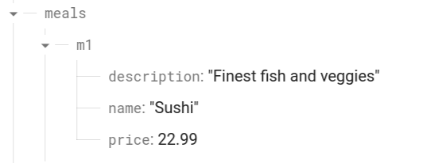
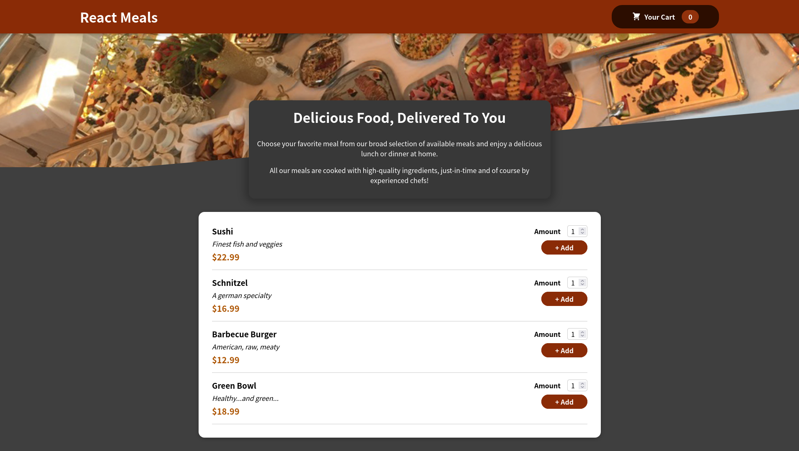
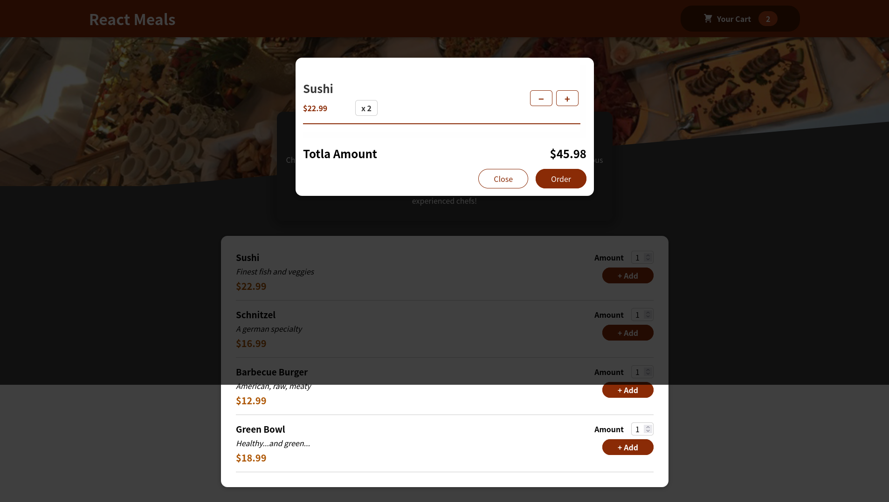
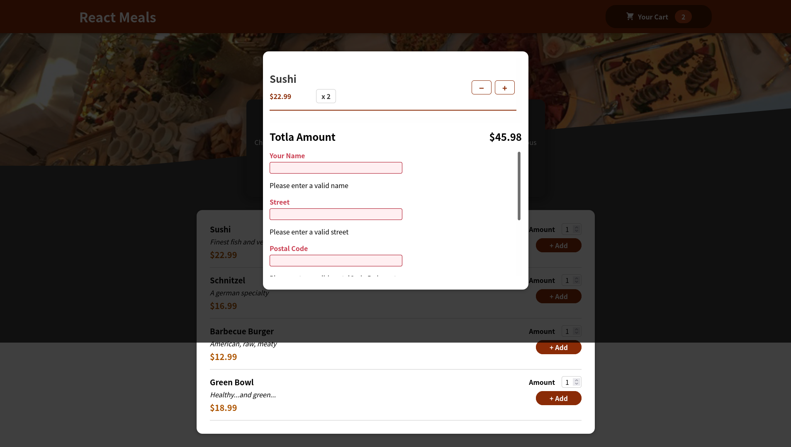
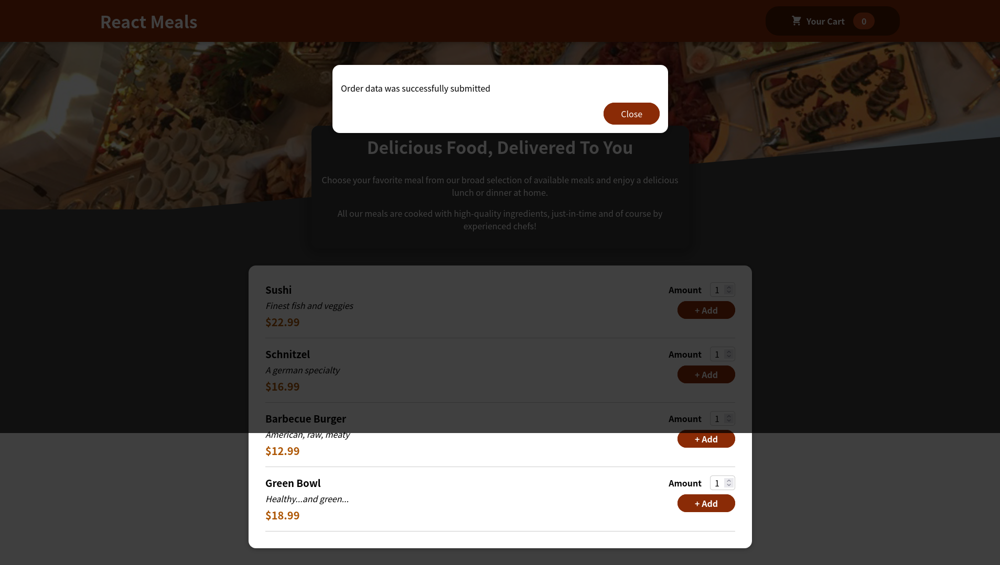

# Food order App

In this application, the following concepts are reflected.

- Biult in React css modules 
- React fragments
- Wrapper UI Components
- React Portals
- react useState
- contextAPI
- refs
- Http request for backend API
- Form validation

# For Local setup
- download the project from GitHub
- open the project root directory in terminal
- run `npm install` or `yarn install`
- create a new file `.env.local` and copy the contents of `.env` file. 
- Add your own firebase endpoint for `REACT_APP_FIREBASEURL` value
- run `npm start` or `yarn start`
- The `AvailableMeals` component assume that you have some Meals available on your firebase server, in the `meals` like the following example image:

### Screen shots

default UI

UI after ordering.

UI with empty inputs

UI after order completed

